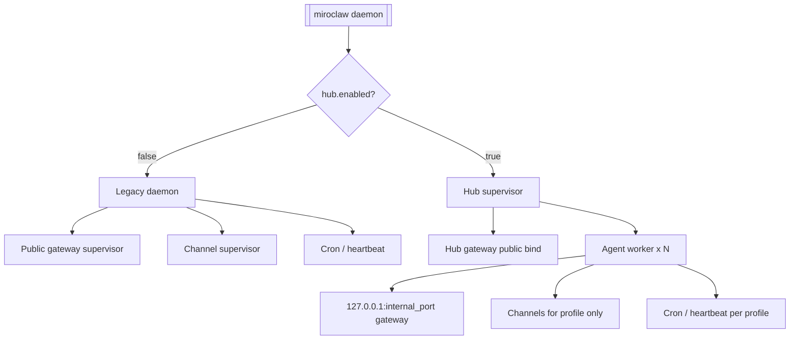

# Agent-Profile Architecture & Public WebSocket Hub

This document describes Miroclaw's **profile-per-agent** layout: one supervisor process, a single public WebSocket endpoint on the hub, and isolated agent workers that each own their config, workspace, and messaging channels.

Last verified: **May 24, 2026**.

## Overview

| Mode | When | What runs |
|---|---|---|
| **Single profile (default)** | `[hub].enabled = false` | Legacy `miroclaw daemon` — one config dir, public gateway + channels in one process |
| **Hub supervisor** | `[hub].enabled = true` | Hub gateway (public) + N agent workers (localhost only) |

Each **agent profile** is a full runtime root:

```
profiles/<name>/
├── config.toml    # provider, channels, memory, cron, …
└── workspace/     # IDENTITY.md, sessions/, memory/, skills/, …
```

Global home layout:

```
~/.miroclaw/
├── config.toml           # hub / supervisor config when [hub].enabled
├── registry.toml         # agent index + internal ports
├── active_agent.toml     # default CLI target (legacy: active_workspace.toml)
├── shared/               # optional shared OAuth cache, open-skills mirror
└── profiles/
    ├── main/
    │   ├── config.toml
    │   └── workspace/
    └── researcher/
        ├── config.toml
        └── workspace/
```

## Architecture Diagram

```mermaid
flowchart TB
    subgraph public [Public Hub]
        HubGW["Hub gateway :8080"]
        HubWS["/ws/chat"]
        HubAPI["/api/agents"]
        HubGW --> HubWS
        HubGW --> HubAPI
    end

    subgraph registry [Global Home]
        Reg["registry.toml"]
        Active["active_agent.toml"]
    end

    subgraph worker_main [AgentWorker main]
        MainCfg["profiles/main/config.toml"]
        MainWS["internal /ws/chat :18080"]
        MainCh["Telegram / Discord / …"]
        MainLoop["gateway sessions + channel turns"]
        MainCfg --> MainWS
        MainCfg --> MainCh
        MainCh --> MainLoop
        MainWS --> MainLoop
    end

    subgraph worker_researcher [AgentWorker researcher]
        ResCfg["profiles/researcher/config.toml"]
        ResWS["internal /ws/chat :18081"]
        ResCh["optional channels"]
    end

    Client["Client / Web UI"] --> HubWS
    HubWS -->|"agent_id=main"| MainWS
    HubWS -->|"switch_agent"| ResWS
    Reg --> HubGW
    Reg --> worker_main
    Reg --> worker_researcher
```



## Invariants

- **One public WebSocket** (`/ws/chat`) on the hub; the client selects **one active agent** at a time (`agent_id` on connect, or `switch_agent` mid-connection).
- **Messaging channels** (Telegram, Discord, Slack, …) start **only inside the agent worker** whose profile owns that channel config — no shared channel bus on the hub.
- **Monitor / attach**: gateway sessions use the existing multi-subscriber session runner; in-flight channel turns expose events via `channels/session_runner` and attach through `session_key` on worker (and hub-proxied) WebSockets.
- **Pairing / bearer auth** applies on the **hub** only; worker gateways bind `127.0.0.1` and trust localhost.

## Registry (`registry.toml`)

```toml
version = 1
profiles_dir = "profiles"
default_agent = "main"

[[agents]]
name = "main"
config_dir = "profiles/main"
enabled = true
internal_port = 18080

[[agents]]
name = "researcher"
config_dir = "profiles/researcher"
enabled = true
internal_port = 18081
```

| Field | Purpose |
|---|---|
| `name` | Registry key and CLI target (alphanumeric, `-`, `_`) |
| `config_dir` | Profile root (relative to home or absolute) |
| `enabled` | When `false`, supervisor skips this worker |
| `internal_port` | Localhost-only gateway port for that worker |

Supervisor reads the registry at startup and spawns one worker per enabled agent.

## Hub WebSocket Protocol

Connect to `ws://<hub-host>:<port>/ws/chat` (pairing token via header, subprotocol, or `?token=`).

**First frame — connect (required `agent_id` on hub):**

```json
{
  "type": "connect",
  "agent_id": "main",
  "session_id": "uuid",
  "session_key": "gw_<uuid>",
  "mode": "interact",
  "last_event_seq": 0
}
```

| Field | Hub | Worker |
|---|---|---|
| `agent_id` | **Required** — selects worker from registry | N/A (single profile) |
| `session_id` | Proxied | Resume or create gateway chat session |
| `session_key` | Proxied | Attach to existing gateway (`gw_*`) or active channel session |
| `last_event_seq` | Proxied | Replay buffered stream events after reconnect |
| `mode` | Reserved (`interact` only in v1) | Same |

**Switch agent (one active agent per public socket):**

```json
{ "type": "switch_agent", "agent_id": "researcher", "session_id": "…" }
```

Hub closes the backend relay, opens a new worker WebSocket, emits `agent_switched`.

**Discovery (handled on hub, no backend required):**

```json
{ "type": "list_agents" }
{ "type": "list_sessions", "agent_id": "main" }
```

REST: `GET /api/agents`, `GET /api/health`.

Worker internal API (localhost): `GET /internal/sessions` — gateway runners + in-flight channel turns.

Hub rejects anonymous connects without `agent_id` (`AGENT_ID_REQUIRED`). Messages before connect return `NOT_CONNECTED`.

## Process Model



## Workflows

### New install (single agent)

1. `miroclaw onboard` — scaffolds `profiles/main/` when using profile-aware defaults (or flat layout with read fallback).
2. `miroclaw agents list` — confirm registry entry for `main`.
3. `miroclaw daemon` — single-profile mode, or enable `[hub]` for supervisor layout.

### Multi-agent hub

1. Create profiles:

   ```bash
   miroclaw agents create main
   miroclaw agents create researcher --from main
   ```

2. Edit each `profiles/<name>/config.toml` (provider, channels, `[clawgotcha].instance_name`, …).

3. Enable hub in `~/.miroclaw/config.toml`:

   ```toml
   [hub]
   enabled = true

   [gateway]
   host = "127.0.0.1"
   port = 8080
   ```

4. `miroclaw daemon` — starts hub + all enabled workers.

5. Connect WebSocket clients with `agent_id` on connect; use `switch_agent` to change target.

### Migrate legacy flat layout

```bash
miroclaw migrate profiles --dry-run
miroclaw migrate profiles
```

Moves `~/.miroclaw/{config.toml,workspace/}` → `profiles/main/`, writes `registry.toml`, sets `active_agent.toml`, and can split legacy `[agents.X]` blocks into separate profiles.

### Delegate / swarm across profiles

The `delegate` and `swarm` tools resolve agent names from:

1. In-profile `[agents.<name>]` (legacy, per-profile config), then
2. **`registry.toml`** — loads the target profile's `config.toml` and runs with that profile's workspace.

Prefer registry profile names for cross-agent orchestration instead of a shared hub-level `[agents]` map.

### Monitor in-flight work

1. `list_sessions` (hub or worker) — active gateway and channel session keys.
2. Connect with `session_key` set to attach:
   - `gw_<session_id>` — gateway chat (multi-subscriber interact)
   - Channel history key — observe in-flight channel turn events (replay + live stream)

### Debug single worker

```bash
miroclaw agents worker --profile main
miroclaw agents worker --profile researcher --port 18081
```

## Config Split

| File | Contains |
|---|---|
| `~/.miroclaw/config.toml` (hub) | `[hub]`, public `[gateway]`, shared `[observability]`, pairing — **no** `[channels.*]`, **no** hub-level `[agents.*]` |
| `profiles/<name>/config.toml` | Full agent runtime: provider, `[channels]`, `[memory]`, `[cron]`, `[clawgotcha].instance_name`, … |

See [config-reference.md](../reference/api/config-reference.md) for `[hub]` keys.

## Clawgotcha

When Clawgotcha is enabled, remote agent upserts create **profile directories + registry entries** (not `[agents]` rows in shared hub config). Each profile should use a unique `[clawgotcha].instance_name`. Details: [clawgotcha.md](../reference/integrations/clawgotcha.md).

## Deprecated (removed or legacy)

| Removed | Replacement |
|---|---|
| `[workspace]` client-profile subsystem | `miroclaw agents` + registry |
| `WorkspaceTool` | Profile CLI |
| Hub-level `[agents.*]` for multi-agent | Registry profiles + per-profile config |
| `agents_list_path` / `agents_list_url` on hub config | Registry; merge skipped when `[clawgotcha].authoritative_over_external_lists` |
| `skills_directory` / `memory_namespace` on delegate entries | Profile workspace isolation |

## Related Docs

- Config keys: [config-reference.md](../reference/api/config-reference.md)
- CLI: [commands-reference.md](../reference/cli/commands-reference.md)
- Setup: [quick-start-command-reference.md](../setup-guides/quick-start-command-reference.md)
- Clawgotcha: [clawgotcha.md](../reference/integrations/clawgotcha.md)
- Daemon ops: [operations-runbook.md](../ops/operations-runbook.md)
- Diagrams index: [architecture-diagrams.md](../assets/architecture-diagrams.md)
